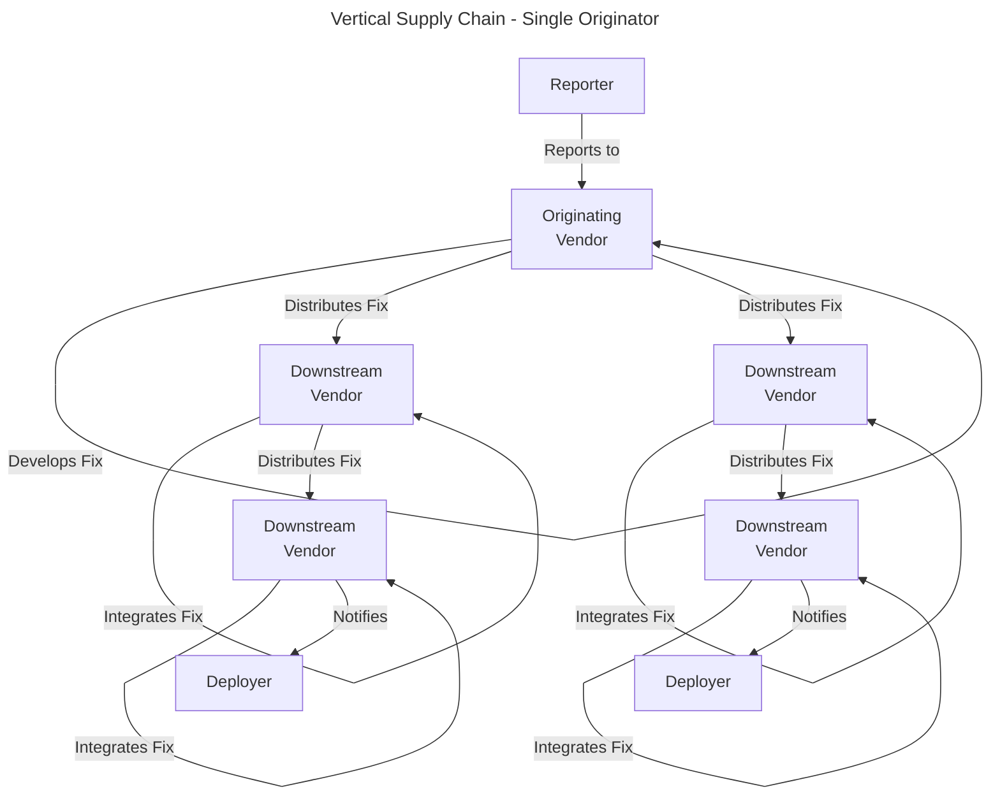
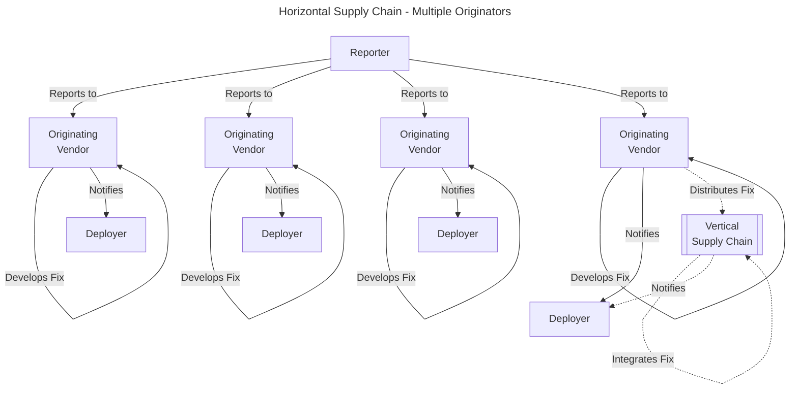

# Multiparty CVD

The simplest instance of CVD is when there are only two parties
involved: the finder of the vulnerability and the vendor who can fix the
software. In this case, many of the complexities that arise in
multiparty situations do not come into play.

!!! tip inline end "Two-Party CVD is Not Always Easy"

    None of this is to say that two-party CVD is always straightforward or easy.
    It can still be difficult for the finder of a vulnerability to make
    contact with the vendor. It can sometimes be difficult for the vendor to
    work with the finder toward a resolution.
    
    Personalities, attitudes, expectations, assumptions, and egos all play a
    part in the success or failure of even two-party CVD.

Most of the interesting cases in CVD involve more than two parties, as
these are the cases where the most care must be taken. Automation of the
process can help somewhat, but the impact technology can have on the
problem is limited by the inherent complexities involved in trying to
get numerous organizations to synchronize their development, testing,
and release processes in order to reduce the risk to users.

From a coordinator's perspective, it can be difficult to be fair, as
you're almost guaranteed to either miss some downstream vendor or wind
up with one or more vendors ready to release while everyone is waiting
for the other vendors to catch up. We discuss this conundrum further in
[Troubleshooting CVD](./cvd_recipes.md).

<br/> <!-- for vertical spacing -->

!!! info inline end "FIRST MPCVD Guidelines and Practices"

    The FIRST [Vulnerability Coordination SIG](https://www.first.org/global/sigs/vulnerability-coordination/){:target="_blank"}
    has published its
    [_Guidelines and Practices for Multi-Party Vulnerability Coordination and Disclosure_](https://www.first.org/global/sigs/vulnerability-coordination/multiparty/guidelines-v1.1){:target="_blank"}
    which we strongly recommend reading.

    Summarizing their guiding concepts and best practices:

    - Establish a strong foundation of processes and relationships
    - Maintain clear and consistent communications
    - Build and maintain trust
    - Minimize exposure for stakeholders
    - Respond quickly to early disclosure
    - Use coordinators when appropriate

!!! tip "Multiparty CVD is About People"

    Success at multiparty coordination has more to do with understanding
    human communication and organization phenomena than with the technical
    details of the vulnerability. The hard parts are nearly always about
    coordinating the behavior of multiple humans with diverse values,
    motives, constraints, beliefs, feelings, and available energy and time.
    The vulnerability details may dictate the "what" of the response, but
    to a large degree human social behaviors decide the
    "how."

In the next few subsections we discuss a number of issues that we have
observed in performing multiparty CVD over the
years.

## Multiple Finders / Reporters

If one person can find a vulnerability, another person can too. While
documented instances of independent discovery are relatively rare,
independent discovery of vulnerabilities can and does happen.

<br/> <!-- for vertical spacing -->
!!! example "Heartbleed and Multiple Finders"

    Perhaps the best known example of multiple finders is [Heartbleed](http://heartbleed.com/){:target="_blank"}
    ([CVE-2014-0160](https://nvd.nist.gov/vuln/detail/cve-2014-0160){:target="_blank"}).
    In part because of the complexity of the coordinated disclosure
    process, a second CVE identifier ([CVE-2014-0346](https://nvd.nist.gov/vuln/detail/CVE-2014-0346){:target="_blank"})
    was assigned to the same vulnerability  and later retracted.

!!! tip "Independent Discovery"

    Independent discovery is a phenomenon where two or more parties
    discover the same vulnerability without any of the parties being aware
    of the others' work. Independent discovery can be a significant
    complicating factor in CVD, as it can lead to multiple reports of the
    same vulnerability, which can in turn lead to confusion, duplication of
    effort, and even conflict among the parties involved.
    We discuss this topic further in [Independent Discovery](./independent_discovery.md).

## Complicated Supply Chains

<!--start-->Many products today are not developed by a single organization.
Instead, they are assembled from components sourced from other
organizations. Vulnerabilities in these components can have far-reaching
impacts and require coordination among multiple parties to resolve.<!--end-->

For example, software libraries are often licensed for inclusion into
other products. When a vulnerability is discovered in a library
component, it is very likely that not only does the originating vendor
of the library component need to take action, but all the downstream
vendors whose products use it need to take action as well. Complex
supply chains can increase confusion regarding who is responsible for
coordinating, communicating, and ultimately fixing vulnerabilities,
leading to delays and systems exposed to unnecessary
risk.



At the CERT/CC, we often find it useful to distinguish between vertical
and horizontal supply chains. While the vertical supply chain is more
common, we do occasionally need to navigate horizontal supply chains in
the course of the CVD
process.

### Vertical Supply Chain

In a vertical supply chain, a vulnerability exists in multiple products
because they all share a dependency on a vulnerable library or
component. One vendor originates the fix. Many vendors then have to
incorporate the originating vendor's fix into their products. Many
vendors have to publish documents, distribute patches, and cause
deployers to take
action.



!!! example "CVD in a Vertical Supply Chain"

    One example of a CVD process following a vertical supply chain is as
    follows: a vulnerability might be initially identified in product X, but
    is then isolated to a library that product X includes as a dependency.
    In this case, the library developer must be engaged as another party to
    the coordination process in the role of patch originator.

    The complexity does not end there though. Once the library vendor has
    completed its patch, not only does the vendor of product X have to
    integrate the fix, but all the other vendors that include the library
    need to update their products as well. We have done this kind of
    coordination in the past with vulnerabilities affecting MS-SQL ([VU#484891](https://www.kb.cert.org/vuls/id/484891){:target="_blank"}),
    Oracle Outside In ([VU#916896](https://www.kb.cert.org/vuls/id/916896){:target="_blank"}), and so on.
    The cascading effects of library
    vulnerabilities often result in significant subsets of users left
    vulnerable while they await their product vendor's
    updates.

    ```mermaid
    ---
    title: Vertical Supply Chain with Library Component
    ---
    flowchart TD
    F[Reporter]
    V2[Vendor]
    VC[Library<br/>Distrubution<br/>Channel]
    F -->|1. Reports to| V2
    V1[Library<br/>Vendor]
    V2 -->|2. Reports to| V1
    V1 -->|3. Develops Fix| V1
    V1 -->|4. Distributes Fix| VC
    V3[Vendor]
    V4[Vendor]
    V5[Vendor]
    VC --> V2
    VC --> V3
    VC --> V4
    VC --> V5
    P[Public]
    V2 -->|5. Integrates Fix| V2
    V3 -->|5. Integrates Fix| V3
    V4 -->|5. Integrates Fix| V4
    V5 -->|5. Integrates Fix| V5
    V1 -->|6. Notifies| P
    V2 -->|6. Notifies| P
    V3 -->|6. Notifies| P
    V4 -->|6. Notifies| P
    V5 -->|6. Notifies| P
    ```

### Horizontal Supply Chain

Even more complex in terms of coordination are cases where multiple
products implement the same vulnerability, which is the primary
characteristic of a horizontal supply chain. Examples include
vulnerabilities arising from underspecified protocols, design flaws, and
the like. Luckily these kinds of vulnerabilities are rare.

CVD can become quite complicated when they occur, because multiple
vendors must originate fixes for their own implementations. Many such
cases combine with each originating vendor's downstream vertical supply
chain as well, which only serves to increase the complexity. Many
vendors have to publish docs and distribute patches, leading to
deployers needing to take multiple actions.

Multiple implementation vulnerabilities can sometimes result from
widespread copying of vulnerable code examples from books or websites or
from developer tutorials that ignore or intentionally disable security
features in order to simplify the learning process.



!!! example "Android SSL MitM as a Multiple Implementation Vulnerability"

    While we cannot
    place the entirety of the blame for widespread Android SSL
    Man-in-the-Middle vulnerabilities like [VU#582497](https://www.kb.cert.org/vuls/id/582497){:target="_blank"} on any
    specific phenomenon, our spot checks of some of the vulnerable apps made
    it clear that parallel implementation of the same errors was a
    contributing factor in many of the affected apps.
    In that case, we identified more than
    [23,000 distinct apps](https://docs.google.com/spreadsheets/d/1t5GXwjw82SyunALVJb2w0zi3FoLRIkfGPc7AMjRF0r4){:target="_blank"},
    and coordinated with thousands of vendors.

!!! example "Protocol Vulnerabilities"

    A more pernicious example of multiple implementation is a vulnerability
    whose root cause lies in the specification or reference implementation
    of a network protocol. Because most vendor's products will specifically
    test for compatibility with these reference artifacts, such cases
    usually imply that every product supporting that feature will need to be
    fixed. Multi-originator cases can be very complex to coordinate. The
    SNMP vulnerabilities found in 2002 via the [OUSPG PROTOS Test Suite
    c06-snmpv1](https://web.archive.org/web/20140901000000*/https://www.ee.oulu.fi/research/ouspg/PROTOS_Test-Suite_c06-snmpv1){:target="_blank"} 
    ([VU#854306](https://www.kb.cert.org/vuls/id/854306){:target="_blank"},
    [VU#107186](https://www.kb.cert.org/vuls/id/107186){:target="_blank"},
    [CA-2002-03](https://insights.sei.cmu.edu/library/2002-cert-advisories/){:target="_blank"})
    represented just such a case, and remain to
    this day among the most complex disclosure cases the CERT/CC has ever
    coordinated.

!!! info "Mass Notifications for Multiparty CVD"

    In their Usenix Security 2016 paper
    [_Hey, You Have a Problem: On the Feasibility of Large-Scale Web Vulnerability Notification_](https://www.usenix.org/conference/usenixsecurity16/technical-sessions/presentation/stock){:target="_blank"},
    Ben Stock, Giancarlo Pellegrino, and Christian Rossow examined issues surrounding large-scale vulnerability notification
    campaigns.
    In this work, which focused on notifying website operators of vulnerabilities in their sites, 
    they highlight significant difficulty in establishing a direct communication channel with vulnerable sites.
    
    The following is from their conclusion:
    
    !!! quote "Stock, Pellegrino, and Rossow on Large-Scale Notifications"
    
        How do we inform affected parties about vulnerabilities on large
        scale? Identifying contact points remains the main challenge that has to
        be addressed by the Internet society, including network providers,
        CERTs, and registrars. We imagine that this problem could, for example,
        be tackled by centralized contact databases, more efficient
        dissemination strategies within hosters/CERTs, or even a new
        notification channel or trusted party responsible for such
        notifications. Until we find solutions to the reachability problem, the
        effects of large-scale notifications are likely to remain low in the
        future.


