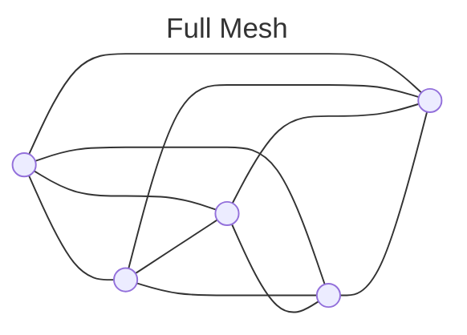
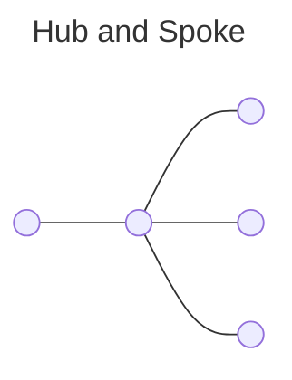
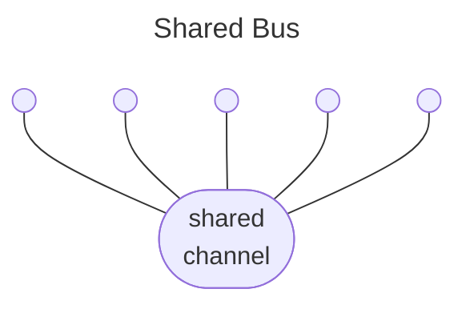

# Communication Topology

!!! example inline end "Pairwise Communication Complexity"

    Graph theory tells us the number of participant pairs increases as $(N^2 - N)/2$ for $N$
    participants. So while there are only 10 pairs for 5 participants, there are 45 pairs for 10 participants.
    

<!--start-->The complexity of coordination problems increases rapidly as more
parties are involved in the coordination effort.
As a result, multiparty coordination using point-to-point
communications do not scale well.<!--end--> 
Borrowing from communication network
concepts, multiparty coordination involving more than a few participants
can be improved with a shift to either a hub-and-spoke or shared-bus
topology in lieu of a full mesh or collection of point-to-point
communications.

## The Evolution of CERT/CC CVD Topology

In the past, the CERT/CC took a hub-and-spoke approach to coordination
for cases where it was feasible to maintain separate conversations with
the affected parties. Maintaining a hub-and-spoke
coordination topology for each distinct case requires some forethought
into tools and practices, though&mdash;you can't just carbon-copy
everybody, and without good tracking tools, keeping tabs on who knows
what can be difficult. A hub-and-spoke topology allows a coordinator to
maintain operational security since each conversation has only two
participants: the coordinator and the other party. The tradeoff is that
the coordinator (hub) can easily become a bottleneck during especially
active coordination situations.

Over time, we recognized that the hub-and-spoke approach was not
scaling to meet the needs of the increasing number of participants in
some coordination efforts. 
Even as early as the early 2000s, some of the larger coordination efforts we encountered
required more of a shared-bus approach through the use of conference
calls, group meetings, and private mailing lists. This approach puts the
CVD participants in direct contact with each other rather than having a
coordinator acting as a proxy for all communications while minimizing
the communication overhead. A shared-bus approach can increase the
efficiency of communications, but can on occasion make it harder to
reach agreement on what is to be done.

### Today: VINCE

!!! info inline end "More about VINCE"

    For more information about the _Vulnerability Information and Coordination Environment_ (VINCE),
    see:

    - [VINCE Announcement](https://insights.sei.cmu.edu/news/certcc-releases-vince-software-vulnerability-collaboration-platform/)
    - [VINCE Documentation](https://vuls.cert.org/confluence/display/VIN)
    - [VINCE GitHub Project](https://github.com/CERTCC/VINCE)
    - [VINCE Login](https://www.kb.cert.org/vince)

More recently, however, with the
[introduction](https://insights.sei.cmu.edu/news/certcc-releases-vince-software-vulnerability-collaboration-platform/)
of the 
[Vulnerability Information and Coordination Environment](https://www.kb.cert.org/vince)
(VINCE), we have adopted the shared-bus approach as our default.
VINCE is a web-based platform that allows for the sharing of information
among multiple parties in a secure environment.
For each new vulnerability, CERT/CC creates a VINCE case discussion, 
which is a private message-board forum complete with the abilities to tag
other participants, upload files, and send CERT/CC private messages. 
CERT/CC then invites reporters, researchers, and vendors related to the 
vulnerability to join the case discussion. To participate, stakeholders
must have a VINCE account, and they can ask CERT/CC to add them to a case
discussion. CERT/CC continues to coordinate and moderate each case,
but the stakeholders can work directly with each other, both before and 
after any public disclosure of the vulnerability.

While VINCE has been a significant improvement in our ability to
coordinate multiparty CVD efforts, it is not a panacea.
For example, it is not always possible to get all stakeholders to
participate in a VINCE case discussion. It is also a single point of
failure, and if it goes down, we lose the ability to coordinate
effectively. 

### Tomorrow: Vultron

!!! vultron inline end "More about Vultron"

    For more information about the _Vultron Protocol_, see:

    - [Vultron Announcement](https://insights.sei.cmu.edu/blog/vultron-a-protocol-for-coordinated-vulnerability-disclosure/)
    - [Vultron Documentation](https://certcc.github.io/Vultron)
    - [Vultron GitHub Project](https://github.com/CERTCC/Vultron)

In response to these limitations, we have embarked on a project to develop 
an open protocol for coordinating and sharing vulnerability case information across organizations.
This project, called the [Vultron Protocol](https://certcc.github.io/Vultron), 
is a research project to explore the creation of a federated, decentralized, 
and open source protocol for coordinated vulnerability disclosure (CVD). 

Our goal is to provide a protocol that can be used by any organization to coordinate the disclosure of vulnerabilities 
in information processing systems (software, hardware, services, etc.), and to build a community of interoperability
across independent organizations, processes, and policies that can work together to coordinate appropriate responses
to vulnerabilities.
Whereas VINCE is a platform, Vultron is a protocol. 

!!! question "What is the difference between a platform and a protocol?"

    A platform is a set of tools and services that are provided by a single entity, while a protocol is a set of 
    rules that allow multiple entities to communicate and coordinate with each other.
    VINCE is a platform that provides a set of tools and services for coordinating vulnerability disclosure,
    while Vultron is a protocol that provides a set of rules for how organizations can communicate and coordinate
    with each other in a decentralized and federated manner.

