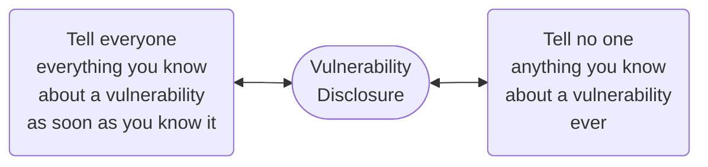

# Why Coordinate Vulnerability Disclosures?

Vulnerability disclosures fall between two extremes:

Prior research at Carnegie Mellon into [vulnerability disclosure practices](https://doi.org/10.1007/s10796-006-9012-5){:target="_blank"} has shown
that neither extreme is socially optimal. Thus, we are given to hope
that we can improve on these extremes by striking a balance in between.
But doing so requires several questions to be answered:

!!! question "Questions to Answer in CVD"

    - How much information should be released?
    - To whom?
    - When?
        - Do you wait for a patch to be deployed before announcing the vulnerability's existence?
        - Do you wait for the patch to be available but not yet deployed?
    - Is it okay to acknowledge that you know of a vulnerability in a product without providing any other details?

It's also important to consider that not all factors are within control
of the parties involved in the disclosure process. Adversaries can
discover vulnerabilities and use them to exploit vulnerable systems
regardless of your participation in a well-coordinated disclosure
process. And yet many vulnerabilities might never be exploited in
attacks. So how should we approach the question of potential harm and
the questions surrounding risk and reward of vulnerability disclosure?

!!! question inline end "Isn't it better to keep vulnerabilities secret?"

    Some vendors express concern about the negative attention brought by
    having a long list of publicly disclosed vulnerabilities in their
    products. In our opinion, the number of vulnerabilities found in a
    vendor's products is less valuable as an indicator of the vendor's
    security stance than the consistency of its response to vulnerabilities
    in a comprehensive and timely manner. In the end, the goal of CVD is to
    help users make more informed decisions about actions they can take to
    secure their systems.

The CERT/CC believes the Coordinated Vulnerability Disclosure (CVD)
process provides a reasonable balance of these competing interests.
<!--start-->The
public and especially users of vulnerable products deserve to be
informed about issues with those products and how the vendor handles
those issues. At the same time, disclosing such information without
review and mitigation only opens the public up to exploitation. The
ideal scenario occurs when everyone coordinates and cooperates to
protect the public.<!--end-->
This coordination may also be turned into a public
relations win for the vendor by quickly addressing the issue, thereby
avoiding bad press for being unprepared.

!!! info "FIRST's Vulnerability Coordination Special Interest Group"

    The [Forum of Incident Response and Security Teams](https://www.first.org){:target="_blank"} (FIRST),
    which consists of many public and private organizations and companies involved
    in vulnerability and security incident handling, has established a
    [Vulnerability Coordination Special Interest Group](https://www.first.org/global/sigs/vulnerability-coordination){:target="_blank"}
    to develop some common
    CVD best practices and guidelines. While the existence of
    individual vulnerabilities may be unexpected and surprising, these
    common practices should help lead to fewer surprises for all
    stakeholders in the CVD process itself.

!!! info "CVD is Recognized by Governments and International Organizations"

    Governments and international organizations also recognize the need for coordinated vulnerability disclosure practices.
    Just to name two examples:

    In 2015, the Department of Commerce's National Telecommunications and Information Administration initiated a
    [Multistakeholder Process for Cybersecurity Vulnerabilities](https://www.ntia.doc.gov/other-publication/2016/multistakeholder-process-cybersecurity-vulnerabilities){:target="_blank"} to
    
    > develop a broad, shared understanding of the overlapping interests
    > between security researchers and the vendors and owners of products
    > discovered to be vulnerable, and to establish a consensus about
    > voluntary principles to promote better collaboration. The question of
    > how vulnerabilities can and should be disclosed will be a critical
    > part of the discussion, as will how vendors receive and respond to
    > this information. However, disclosure is only one aspect of successful
    > collaboration.

    In 2023, the [European Union Agency for Cybersecurity](https://www.enisa.europa.eu/){:target="_blank"}
    published a [report on Coordinated Vulnerability Disclosure](https://www.enisa.europa.eu/news/coordinated-vulnerability-disclosure-towards-a-common-eu-approach){:target="_blank"}
 
    > With the new Directive on measures for a high common level of cybersecurity across the Union (NIS2) adopted on
    > 16 January 2023, Member States will need to have a coordinated vulnerability disclosure policy adopted and
    > published by 17 October 2024. In addition, other ongoing legislative developments will also address vulnerability 
    > disclosure, with vulnerability handling requirements already foreseen in the proposed Cyber Resilience Act (CRA).
    > The new report published today looks into the expectations of both industry and the Member States in relation to 
    > the NIS2’s objective. It also analyses the related legal, collaborative, technical challenges arising from such 
    > initiatives.

    attack frequency increase with vulnerability disclosure? An
    empirical analysis," *Information Systems Frontiers,* vol. 8, no.
    5, pp. 350-362, 2006.
