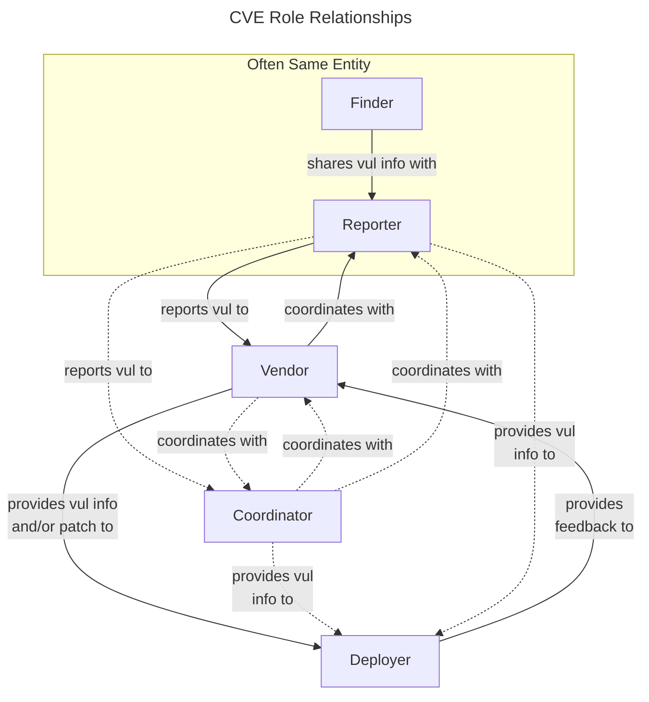

# Roles in CVD 

!!! quote "Margaret Mead"

    What people say, what people do, and what they say they do are entirely different things.
    

Certain roles are critical to the Coordinated Vulnerability Disclosure
process, as described below:

-   **Finder (Discoverer)** -- the individual or organization that
    identifies the vulnerability
-   **Reporter** -- the individual or organization that notifies the
    vendor of the vulnerability
-   **Vendor** -- the individual or organization that created or
    maintains the product that is vulnerable
-   **Deployer** -- the individual or organization that must deploy a
    patch or take other remediation action
-   **Coordinator** -- an individual or organization that facilitates
    the coordinated response process

Although a more detailed description of the CVD process is provided in
Section 4, a simple sketch of the relationships between these roles is
shown in Figure 1.

!!! tip "Participants Can Play Multiple Roles"

    It is possible and often the case that individuals and organizations
    play multiple roles. For example, a cloud service provider might act as
    both vendor and deployer, while a researcher might act as both finder
    and reporter. A vendor may also be both a deployer and a coordinator. In
    fact, the CERT/CC has played all five roles over time, although not
    usually simultaneously.

- [Finder](finder)
- [Reporter](reporter)
- [Vendor](vendor)
- [Deployer](deployer)
- [Coordinator](coordinator)
- [Other Roles and Variations](other_roles)

