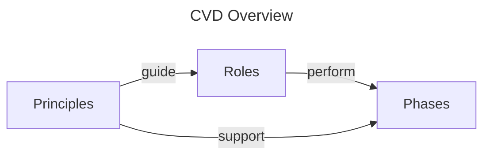

# Understanding CVD

While we provide more practical guidance in the [How To](../howto/index.md) section,
this section provides a more abstract understanding of Coordinated Vulnerability Disclosure (CVD).
This section is intended for those who want to understand the principles, roles, and phases of CVD.




