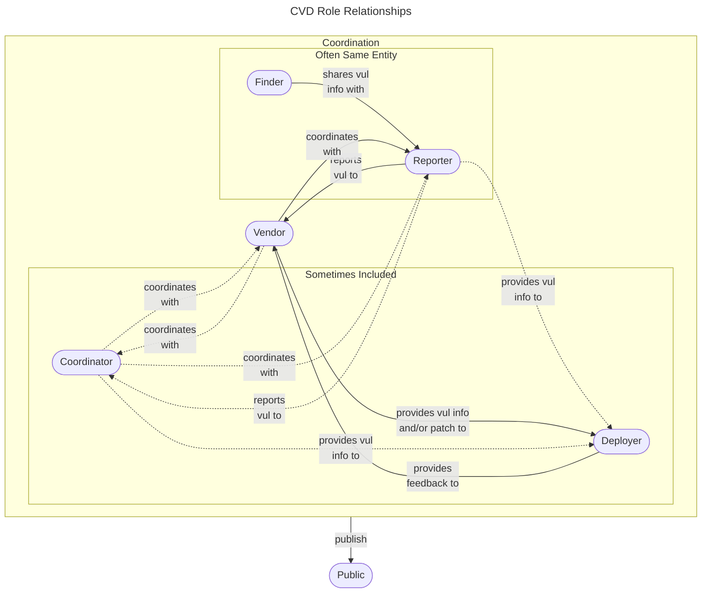

# Phases of Coordinated Vulnerability Disclosure

Below, we adapt a version of the 
[ISO/IEC 30111:2019 Information technology&mdash;Security techniques&mdash;Vulnerability handling processes](https://www.iso.org/standard/69725.html)
with more phases to better describe what we have seen at the CERT/CC

- :material-magnify: [**Discovery**](discovery.md)

    ---
    A researcher (not necessarily an academic one) discovers a vulnerability by using one of numerous tools and processes.
 
- :material-message-alert: [**Reporting**](reporting.md)
    
    ---
    A researcher submits a vulnerability report to a software or product vendor, or a third-party coordinator if necessary.

- :material-message-check: [**Validation**](validation.md) and :material-format-list-numbered: [**Prioritization**](prioritization.md)

    ---
    The analyst validates the report to ensure accuracy before action can be taken and prioritizes reports relative to others.

- :material-code-block-braces: [**Remediation**](remediation.md)

    ---
    A remediation plan (ideally a software patch, but could also be other mechanisms) is developed and tested.

- :material-newspaper: [**Public Awareness**](public_awareness.md) 

    ---
    The vulnerability and its remediation plan is disclosed to the public.

- :material-server-network: [**Deployment**](deployment.md)

    ---
    The remediation is applied to deployed systems.

!!! info "Vulnerability Handling Process Models"

    There have been a number of proposed models of the CVD process that have slightly varying phases. Some of the most notable include:

    - 2002 Christey and Wysopal [Responsible Vulnerability Disclosure Process](https://datatracker.ietf.org/doc/draft-christey-wysopal-vuln-disclosure/)
    - 2004 National Infrastructure Advisory Council [Vulnerability Disclosure Framweork](https://www.dhs.gov/xlibrary/assets/vdwgreport.pdf)
    - 2018 ISO/IEC 29147:2018 [Information technology -- Security techniques -- Vulnerability disclosure](https://www.iso.org/standard/72311.html)
    - 2019 ISO/IEC 30111:2019 [Information technology -- Security techniques -- Vulnerability handling processes](https://www.iso.org/standard/69725.html)

## Who Does What?

Extending the diagram from the [Roles in CVD](../roles/index.md) page,
we can see how the roles interact in the CVD process.

A mapping of CVD phases to CVD roles is provided in the following table.

| Role &rarr; Phases &darr; | Finder                | Reporter                                        | Vendor                                         | Coordinator                                                   | Deployer                          |
|-------------------------------|-----------------------|-------------------------------------------------|------------------------------------------------|---------------------------------------------------------------|-----------------------------------|
| Discovery                     | Finds Vulnerabilities | -                                               | -                                              | -                                                             | -                                 |
| Reporting                     | Prepares report       | Reports vuls to vendor(s) and/or coordinator(s) | Receives reports                               | Receives reports                                              | -                                 |
| Validation                    | -                 | -                                               | Validates reports received                     | Validates reports received                                    | -                                 |
| Prioritization               | -                     | -                                               | Prioritizes reports for response               | Prioritizes reports for response                              | Prioritizes fixes for deployment |
| Remediation                   | -                     | Confirms fix                                    | Prepares patches, develops advice, workarounds | Coordinates multiparty response, develops advice, workarounds | -                                 |
| Public Awareness              | Publishes advisory      | Publishes advisory                                | Publishes advisory                               | Publishes advisory                                               | Receives advisory                   |
| Deployment                    | -                     | -                                               | -                                              | -                                                             | Deploys fix or mitigation         |

