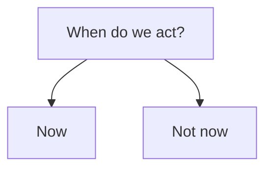

# Prioritization

Once the receiver of a report has [validated](validation.md) the report
as in scope, credible, and valid, the next question is how to allocate resources to the report.
Not every report can be addressed immediately, so prioritization is necessary.

At the most basic level, prioritization can be thought of as a simple binary decision:

In practice, however, prioritization can be more complex.

!!! ssvc "Stakeholder-Specific Vulnerability Categorization (SSVC)"

    The CERT/CC's [Stakeholder-Specific Vulnerability Categorization](https://certcc.github.io/SSVC){:target="_blank"} (SSVC)
    provides a method for developing vulnerability management decision models
    that are tailored to the specific needs of different stakeholders.
    Much of what we have to say about prioritization is already covered in that documentation.

!!! question "Who Receives Reports?"

    The receiver of a report is typically a [vendor](../roles/vendor.md), but it could also be a
    [coordinator](../roles/coordinator.md) or a [deployer](../roles/deployer.md).


