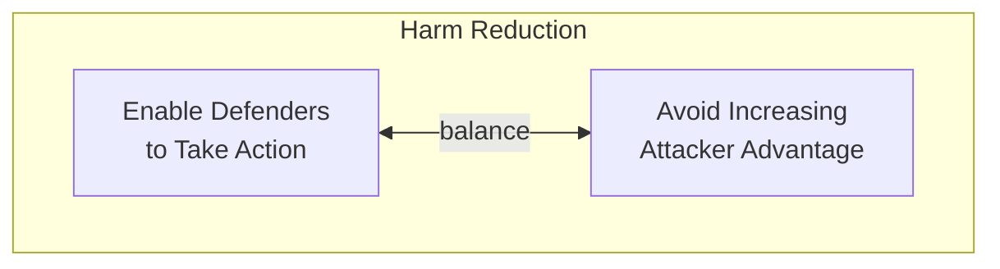

# Reduce Harm

Harm reduction is a term borrowed from the public health community. In
that context, it is used to describe efforts intended to reduce the harm
caused by drug use and unsafe health practices, rather than on the
eradication of the problem.

!!! info "Harm Reduction in Public Health"

    One of the tenets of harm reduction is that there will never be a drug-free society, 
    and so preparations must be made to reduce the harm of drugs that currently
    exist since we will never be completely free of them. This
    concept applies to software vulnerabilities as well: that it may be
    possible to reduce the potential for harm even if vulnerabilities cannot
    be fully eliminated.

    For more on Harm Reduction in the public health context, see

    - [National Harm Reduction Coalition](http://harmreduction.org/about-us/principles-of-harm-reduction/)
    - [Harm Reduction International](https://www.hri.global/what-is-harm-reduction)

<!--excerpt-start-->At its core, harm reduction with respect to vulnerable software is about
balancing the ability for system defenders to take action while avoiding
an increase in attacker advantage.<!--excerpt-end--> Experience has shown that nearly all
software-centric products contain vulnerabilities, and this will likely
remain true, especially as code complexity continues to increase.

In fact, the potential for vulnerabilities will likely never go away
since a previously secure system can become vulnerable when deployed
into a new context, or simply due to environmental changes or the
development of novel attack techniques. Systems tend to outlive their
threat models. 

!!! example "The Flatiron Building in New York City"

    The Flatiron Building in New York City stands as an
    example of this phenomenon in the physical world. Built prior to the
    Wright brothers' flight at Kitty Hawk, NC, today it is vulnerable to
    attack using an airliner as a weapon. It's difficult to argue that the
    designers should have "built security in" for attacks that would have
    been considered [science fiction](https://resources.sei.cmu.edu/library/asset-view.cfm?assetid=442528) at the time of deployment.

Since vulnerabilities are likely to persist despite our best efforts,
CVD works best when it focuses on reducing the harm vulnerabilities can
cause. 

!!! tip "Approaches to Reduce Harm in CVD"

    Some approaches to reducing the harm caused by vulnerable
    software and systems include the following:

    - **Publish vulnerability information**. Providing high-quality,
    timely, targeted, automated dissemination of vulnerability
    information enables defenders to make informed decisions and take
    action quickly.

    - **Encourage the adoption and widespread use of exploit mitigation
    techniques** on all platforms.

    - **Reduce days of risk**. [Selecting reasonable disclosure deadlines](https://link.springer.com/article/10.1007/s10796-006-9012-5) is
    one way of achieving the goal of minimizing the time between a
    vulnerability's discovery and the remediation of its last deployed
    instance. 

    - **Release high-quality patches**. Increasing defenders' trust that
    patches won't break things or have undesirable side effects reduces
    lag in patch deployment by reducing the defenders' testing burden.

    - **Automate patch deployment** Automation coupled with a high degree of deployer trust in patch quality
    can improve patch deployment rates. To avoid automated deployment mechanisms becoming a new
    target for adversaries, vendors should use secure update mechanisms including
    cryptographically signed updates or other technologies.

