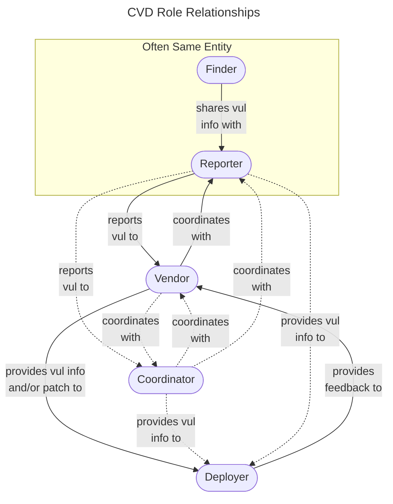
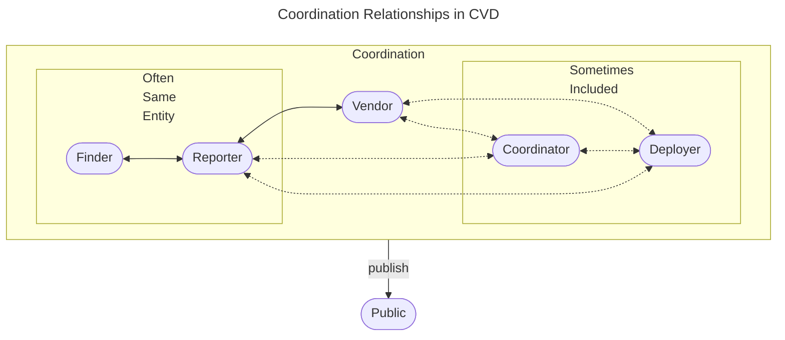

# Roles in CVD

Certain roles are critical to the Coordinated Vulnerability Disclosure
process, as described in the following sections:

- :material-magnify: [**Finder (Discoverer)**](finder.md) -- the individual or organization that identifies the vulnerability
- :material-message-alert: [**Reporter**](reporter.md) -- the individual or organization that notifies the vendor of the vulnerability
- :material-code-braces: [**Vendor**](vendor.md) -- the individual or organization that created or maintains the product that is vulnerable
- :material-server: [**Deployer**](deployer.md) -- the individual or organization that must deploy a patch or take other remediation action
- :material-arrow-decision: [**Coordinator**](coordinator.md) -- an individual or organization that facilitates the coordinated response process
- :octicons-people-16: [**Other Roles**](other_roles.md) -- other roles that may be involved in the CVD process

!!! tip "Participants Can Play Multiple Roles"

    It is possible and often the case that individuals and organizations
    play multiple roles. For example, a cloud service provider might act as
    both vendor and deployer, while a researcher might act as both finder
    and reporter. A vendor may also be both a deployer and a coordinator. In
    fact, the CERT/CC has played all five roles over time, although not
    usually simultaneously.

## Relationships Between Roles

Although a more detailed description of the CVD process is provided in [Phases of CVD](../phases/index.md), a simple sketch of the relationships
between these roles is shown in the figure below.

An even simpler sketch of the relationships between these roles is shown in the figure below.

