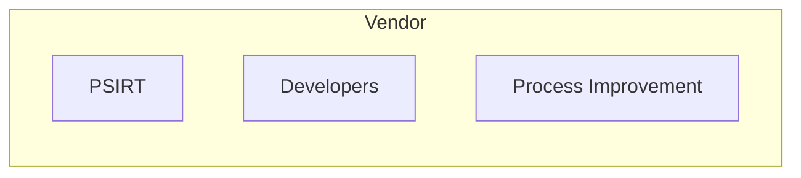

# Vendor

The *vendor* is the party responsible for updating the product
containing the vulnerability. Most often a vendor is a company or other
organization, but an individual can also be a vendor. For example, a
student who developed an app and placed it in a mobile app store for
free download meets this definition of vendor, as does a large
multinational company with thousands of developers across the globe.
Many open source libraries are maintained by a single person or a small
independent team; we still refer to these individuals and groups as
vendors.

!!! example inline end "Vendor Perspectives"

    The [NTIA Awareness and Adoption Working Group survey](https://www.ntia.doc.gov/files/ntia/publications/2016_ntia_a_a_vulnerability_disclosure_insights_report.pdf)
    found the following:

    - 60-80% of the more mature vendors followed CVD practices
    - 76% of those mature vendors developed their vulnerability handling
      procedures in-house.
    - Vendors' perceived need for a vulnerability disclosure policy was
      driven by a sense of corporate responsibility or customer demand.
    - Only a third of responding companies considered and/or required
      suppliers to have their own vulnerability handling procedures.

!!! tip "Vendors Include More Than Just Software Companies"

    As software-centric systems find their way into various industries, more
    and more vendors of traditional products find themselves becoming
    software vendors. 
    Moving beyond traditional software companies, recent years have seen the
    rise in networked products and services from a variety of industries,
    including those below:

    - consumer products, such as home automation and the internet of
    things (IoT)
    - internet service providers (ISPs) and the makers of devices that
    access ISP services: internet modems, routers, access points, and
    the like
    - mobile phone manufacturers and service providers
    - industrial control systems, building automation, HVAC manufacturers
    - infrastructure suppliers and increasingly "smart" utility services
    including water and sewer services and the energy industry
    - transportation services, including the airline and automotive
    industries
    - medical devices and health-related device manufacturers


!!! tip "Vendors as Part of the Software Supply Chain"

    Although a single vendor is usually the originator of a patch for a
    given vulnerability, this is not always the case. Some vendors will have
    products affected by a vulnerability while they are not the originator
    of the initial fix.
    Furthermore, since many modern products are in fact composed of
    software and hardware components from multiple vendors, the CVD process
    increasingly involves multiple tiers of vendors, as we discuss in
    [Multiparty CVD](../../howto/variation/mpcvd.md).
    Ideally the CVD process should cover not just the
    patch originator but also the downstream vendors. The complexity of the
    software supply chain can make this difficult to coordinate.


!!! example "Vendor Dependencies"

    !!! example inline end ""

        ```mermaid
        ---
        title: Vendor Dependencies
        ---
        
        flowchart LR
        
        v1[Vendor]
        v2[Vendor]
        v3[Vendor]
        v4[Vendor]
        v5[Vendor]
        
        v1 --> v2
        v1 --> v3
        v2 --> v4
        v3 --> v4
        v3 --> v5
        ```

    For example, the CVD
    process for a vulnerability in a software library component may need to
    include the originating author of the vulnerable component as well as
    all the downstream vendors who incorporated that component into their
    products. Each of these vendors in turn will need to update their
    products in order for the fix to be deployed to all vulnerable
    systems.


!!! warning "Vendor as the Introducer of Vulnerabilities"

    The vendor often plays an important but less discussed role as well, as
    the creator of the software or system that introduces the vulnerability.
    While good practices like code reviews, continuous testing and
    integration, well-trained developers, mentoring, architectural choices,
    and so forth can reduce the rate of introduction of new vulnerabilities,
    these practices thus far have not eliminated them completely. Thus, a
    well-established CVD capability is also essential to the development
    process.


## Vendor Sub-Roles

There are various sub-roles one might find within a vendor organization.
In small organizations, an individual might play all the sub-roles at
once. Larger organizations often have teams that correspond to the
sub-roles identified here. Each of these sub-roles has a part to play in
the vendor's vulnerability response practice.



!!! tip "Product Security Incident Response Team (PSIRT)"

    

    A vendor might choose to establish a Product Security Incident Response
    Team (PSIRT). This is similar to a Computer Security Incident Response
    Team (CSIRT), but is engaged for product security "incidents" (e.g.,
    vulnerability reports and reports of exploitation of the company's
    products). The PSIRT acts as an interface between the public and the
    developers. We describe PSIRTs in more detail in the [Coordinator](coordinator.md) section.




!!! tip "Developers"

    For vendors of sufficient size to have a dedicated PSIRT, the
    vulnerability response and development processes are likely found in
    different parts of the organization.

    The development role usually has the responsibility to:

    - identify what to fix and how to fix it
    - create the patch
    - integrate the patch into releasable products

    The PSIRT should be in close contact with the developers in order to
    coordinated fixes.

!!! tip "Process Improvement"

    We describe process improvement as a sub-role because it is often
    necessary to improve the development process in order to prevent
    vulnerabilities from being introduced in the first place. Some vendors
    have a dedicated role for this, while in others it is a part-time
    responsibility of the PSIRT or the developers.


!!! tip "Vendor Response Process"
    
    We outline the vendor response process in more detail in
    [Vendor Vulnerability Response Process](../../tutorials/response_process/vendor.md).