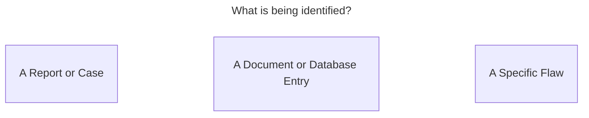
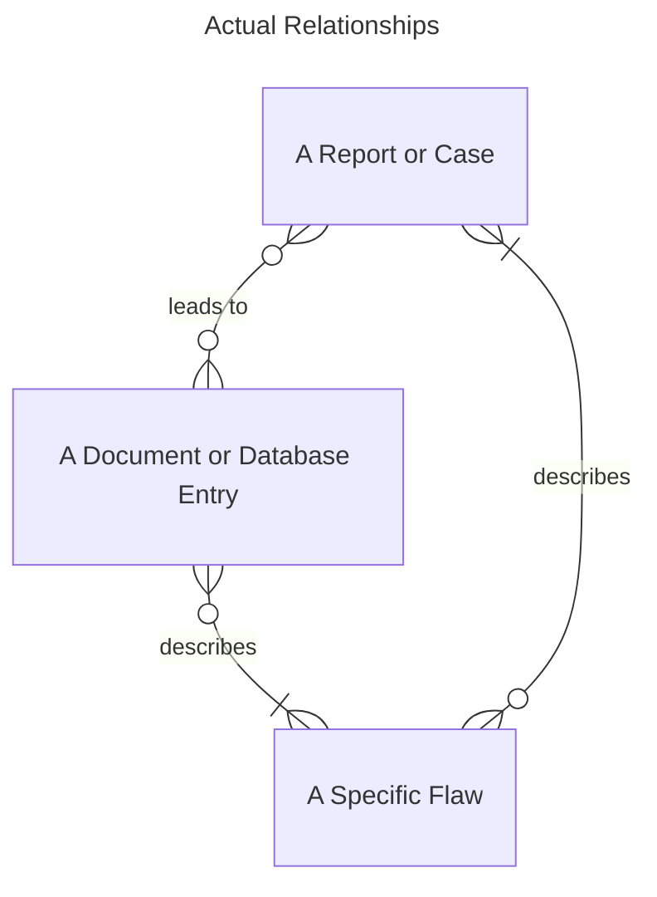
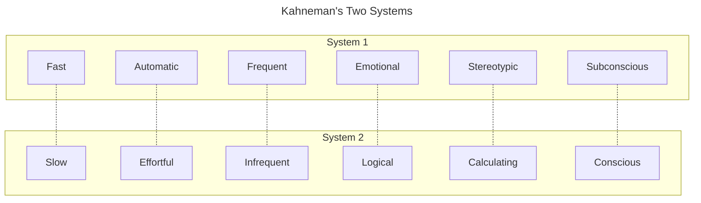

# Vulnerability IDs and DBs

The units of work in CVD are vulnerability reports or cases. However, a
single case may actually address multiple vulnerabilities. Teasing out
how many problems are involved in a report can be tricky at times. The
implications of this in terms of the CVD process and the compilation of
vulnerability databases is significant.

This section is adapted from a [CERT/CC blog post](https://insights.sei.cmu.edu/blog/vulnerability-ids-fast-and-slow/){:target="_blank"}.

## On the Complexities of Vulnerability Identity

Vulnerability identifiers can serve multiple purposes.

They may be used to identify the following:

- A vulnerability report or case
- A document or database entry that describes a vulnerability (e.g.,
    [CERT Vulnerability Notes](https://www.kb.cert.org/vuls){:target="_blank"})
- The [specific flaw](https://www.cve.org){:target="_blank"} that such a document or report describes

Now this isn't really a problem as long as one case describes one
vulnerability and that case results in the creation of one document. But
that's not always the case, for a number of reasons, including those
below:

- Different processes use different abstractions to define what "unit
    vulnerability" is. For example, CVE has [specific guidance](https://www.cve.org/ResourcesSupport/AllResources/CNARules){:target="_blank"} on
    counting rules.

- It's rare for vendors to release single-issue patches. More often
    they prefer to roll up multiple fixes into a single release, and
    then publish a document about the release.

- In the case of independent discovery, or at least duplicate
    reporting, multiple cases may be opened describing the same
    vulnerability. In some instances, this fact may not become obvious
    until considerable effort has been put into isolating the bugs in
    each report. For example, a single vulnerability can manifest in
    different ways depending on how it's triggered. The connection
    might only be discovered on root cause analysis.

- Automated testing such as fuzzing can lead to rapid discovery of
    very large numbers of unique failure cases that are difficult to
    resolve into specific bugs.

!!! example "Automated Testing"

    Automated testing can also identify so many individual vulnerabilities
    that human-oriented case handling processes cannot scale to treat each
    one individually. 
    Here's an extreme example of this phenomenon:
    although the CERT/CC published only a single Vulnerability Note 
    [VU#582497](https://www.kb.cert.org/vuls/id/582497){:target="_blank"} for
    Android apps that failed to validate SSL certificates, in the end it
    covered 23,667 [vulnerable apps](https://docs.google.com/spreadsheets/d/1t5GXwjw82SyunALVJb2w0zi3FoLRIkfGPc7AMjRF0r4){:target="_blank"}. Should each get its own
    identifier? Yes, and we did assign individual VU# identifiers to each
    vulnerable app. But this highlights the distinction between the
    vulnerability and the document that describes it.

!!! info "AI/ML and Vulnerability Identification"

    We have recently been exploring the implications of vulnerability identification
    in Artificial Intelligence and Machine Learning (AI/ML) systems. 
    In our 2021 paper [*On managing vulnerabilities in AI/ML systems*](https://doi.org/10.1145/3442167.3442177){:target="_blank"},
    we discuss a number of challenges in identifying vulnerabilities in AI/ML systems, including the
    difficulty of localizing the source of a vulnerability in a complex system to a specific component.
    We expect to have more to say on this topic in the future.

!!! info "Prior work: Vulnerability Cross-Reference (VXREF)"

    When this content was first published, work was underway within the
    [Vulnerability Report Data Exchange](https://www.first.org/global/sigs/vrdx/){:target="_blank"}
    special interest group (VRDX-SIG)
    within [FIRST](https://www.first.org/){:target="_blank"} on a vulnerability report cross-reference data model that
    would allow for the expression of relationships between vulnerability
    reports. That work has since concluded, and the resulting data model
    can be found on Github at [FIRSTdotorg/vrdx-sig-vxref-wip](https://github.com/FIRSTdotorg/vrdx-sig-vxref-wip){:target="_blank"}

    In order to make it easier to relate vulnerability reports and records
    to each other, the VXREF work represents the following concepts:
    `possibly related`, `related`, `not equal`, `equal`, `superset`, `subset`, and `overlap`.

!!! warning "What CVE Isn't"

    Because of the prevalence and popular use of CVE IDs in the
    vulnerability response space, many people assume that vulnerability
    identity is synonymous with [Common Vulnerabilities and Exposures](https://www.cve.org){:target="_blank"} (CVE).
    However, let's briefly look at some ways in which that assumption is inaccurate:

    - CVE has limited scope of coverage.
    - Not all known vulnerabilities are assigned a CVE ID.

## Every Vulnerability Database Makes Choices

As the CERT/CC's vulnerability analysis efforts have expanded into
[vulnerability coordination for non-traditional computing products](https://insights.sei.cmu.edu/blog/coordinating-vulnerabilities-iot-devices/){:target="_blank"}
(mobile, vehicles, medical devices, IoT, ΑΙ/ΜL, etc.), we've also begun
to hit up against another set of issues affecting vulnerability
identities and compatibility across vulnerability databases (VDBs):
namely, bias.

!!! info "Buying Into the Bias: Why Vulnerability Statistics Suck"

    Steve Christey Coley and Brian Martin mention a number of biases that
    affect all VDBs in their BlackHat 2013 talk ([video](https://www.youtube.com/watch?v=3Sx0uJGRQ4s){:target="_blank"}|[pdf](https://media.blackhat.com/us-13/US-13-Martin-Buying-Into-The-Bias-Why-Vulnerability-Statistics-Suck-WP.pdf){:target="_blank"}):

    - **Selection bias**. Not all products receive equal scrutiny. Not all
    vul reports are included in VDBs.
    - **Publication bias**. Not all results get published. Some vuls are
    found but never reported to anyone.
    - **Abstraction bias**. This bias is an artifact of the process that
    VDBs use to assign identifiers to vulnerabilities. (Is it 1 vul or
    3?, 23,667 or 1?)
    - **Measurement bias**. This bias encompasses errors in how a
    vulnerability is analyzed, verified, and catalogued.

Ideally, bias would be factored into analytical results based on the data collected.
But VDBs don't exist solely in the service of scientific purity.
Every vulnerability database or catalog makes choices driven by the business requirements and organizational
environments in which those VDBs operate.

These choices include the following:

- **Sources of vulnerability information monitored**

    ---
    Monitoring all
    the potential sources of vulnerability information is unrealistic
    for resource-constrained VDBs; to date we have found none that are
    not so constrained. This choice is one source of selection bias.

- **Inclusion and exclusion criteria**

    ---
    Rules that define what subset
    of records from the sources monitored will be included (or not) in
    the VDB must be decided. What kind of vulnerabilities does the VDB
    track? Is it platform specific? Is it just a single vendor
    collecting reports in its own products? Is it focused on a
    particular business sector? This choice is another source of
    selection bias.

- **Content detail**

    ---
    How much (and what kind of) detail goes into
    each record in a VDB is something that must be decided: for example,
    whether to include exploit information, workarounds, detection
    criteria, and so forth.

- **Abstraction**

    ---
    What is a "unit" vulnerability? Does this report
    represent one vul or many? That choice depends on what purpose the
    VDB serves. Christey and Martin cover this issue in their list of
    biases, describing it as "the most prevalent source of problems for
    analysis."
    For example, the CVE program has specific [assignment rules](https://www.cve.org/ResourcesSupport/AllResources/CNARules){:target="_blank"}.

!!! note "Different Contexts, Different Choices"

    Even if two vulnerability databases agree
    on these first four items, over time it's easy to wind
    up with completely distinct data sets due to next four.

- **Uncertainty tolerance**

    ---
    How certain is the information included
    in the record? Is the goal of the VDB to be authoritative on first
    publication? Or can it tolerate being wrong sometimes in favor of
    getting things out more quickly?

- **Latency tolerance**

    ---
    How quickly do new records need to be placed
    in the VDB following the initial disclosure? This choice is a
    distinct tradeoff with uncertainty: consider the differences between
    breaking news coverage and a history book.

- **Capacity constraints**

    ---
    For a VDB, incoming vulnerability report volume is
    unconstrained while the capacity to consume and process those
    reports into database records is decidedly not (especially with
    humans in the loop, and as of this writing they still are).

- **Users and consumers of the data**

    ---
    Ultimately, a VDB must serve
    some useful purpose to some audience in order for it to continue to
    exist. There is a wide variety of uses for the information contained
    in VDBs (vulnerability scanning, vulnerability management systems,
    long-term trend analysis, academic research, quality improvement
    efforts, supporting acquisition or purchasing decisions, evaluating
    vendor process effectiveness, etc.), so it shouldn't be surprising
    that user requirements can drive many of the other choices the VDB
    operators have to make.

## Where We Are vs. Where We Need to Be

The vulnerability databases you are probably most familiar with, such as
the [National Vulnerability Database](https://nvd.nist.gov){:target="_blank"} (NVD),
[Common Vulnerabilities and Exposures](https://www.cve.org){:target="_blank"} (CVE), and the
[CERT Vulnerability Notes Database](https://www.kb.cert.org/vuls){:target="_blank"}
have historically focused on vulnerabilities affecting
traditional computing platforms (Windows, Linux, OS X, and other
Unix-derived operating systems) with only a smattering of coverage for
vulnerabilities in other platforms like mobile or embedded systems,
websites, and cloud services.

In the case of websites and cloud services
this gap may be acceptable since most such services are effectively
single instances of a large-scale distributed system and therefore only
the service provider needs to apply a fix. In those cases, there might
not be a need for a common identifier since nobody is trying to
coordinate efforts across responsible parties. But in the mobile and
embedded spaces, we definitely see the need for identifiers to serve the
needs of both disclosure coordination and patch deployment.

<!-- TODO mention EU & ENISA vul db? -->
Furthermore, there is a strong English language and English-speaking
country bias in the major U.S.-based VDBs (hopefully this isn't
terribly surprising). China has not one but two major VDBs: [China
National Vulnerability Database of Information Security](https://en.wikipedia.org/wiki/Chinese_National_Vulnerability_Database){:target="_blank"} (CNNVD)
and [China National Vulnerability Database](http://www.cnvd.org.cn/){:target="_blank"} (CNVD).
We have been
working with CSIRTs around the world (e.g., [JPCERT/CC](https://www.jpcert.or.jp/english/){:target="_blank"}
and [NCSC-FI](https://www.viestintavirasto.fi/en/cybersecurity.html){:target="_blank"}
to coordinate vulnerability response for years and realize the
importance of international cooperation and interoperability in
vulnerability response.

Given all the above, and in the context of the
surging prevalence of bug bounty programs, it seems likely that in the
coming years there will be more, not fewer VDBs around the world than
there are today. We anticipate those VDBs will cover more products,
sectors, languages, countries, and platforms than VDBs have in the past.

Coordinating vulnerability response at local, national, and global
scales requires that we have the means to relate vulnerability reports
to each other, regardless of the process that originated them.
Furthermore, whether they are driven by national, commercial, or
sector-specific interests, there will be a need for interoperability
across all those coordination processes and the VDBs into which they
feed.

## Vulnerability IDs, Fast and Slow

Over time, it has become clear that the days of the "One Vulnerability
ID to Rule Them All" are coming to a close and we need to start
planning for that change. As we've covered above, one of the key
observations we've made has been the growing need for multiple
vulnerability identifiers and databases that serve different audiences,
support diverse business practices, and operate at different
characteristic rates.

In his book [*Thinking, Fast and Slow*](https://en.wikipedia.org/wiki/Thinking,_Fast_and_Slow){:target="_blank"}, Daniel Kahneman
describes human thought processes in terms of two distinct systems:

Making the analogy to CVD processes, notice that historically there has
been a need for slower, consistently high-quality, authoritative
vulnerability records, trading off higher latency for lower noise.
Deconfliction of duplicate records happens before an ID record (e.g., a
CVE record) is issued, and reconciliation of errors can be difficult. To
date, this practice is the ideal for which many VDBs have strived. Those
VDBs remain a valuable resource in the defense of systems and networks
around the globe.

!!! question "Do we need a *System 1* for vulnerability IDs?"

    Yet there is a different ideal, just as valid: one in which
    vulnerability IDs are assigned quickly, possibly non-authoritatively,
    and based on reports of variable quality. This process looks more like
    "issue first, then deconflict." For this new process to work well, post-hoc
    reconciliation needs to become easier.

    <!-- responsiveness, eventually correct -->
    Such a process might be more like a newsroom than a history book. It's
    more about getting the information out quickly than getting it right
    the first time. That's not to advocate for sloppiness, but rather to
    recognize that the need for quick response is sometimes more important
    than the need for perfect response.

    In the long run, assigning IDs quickly can facilitate coordinated response to a
    vulnerability, but it can also lead to confusion if the IDs are
    incorrect or if the same vulnerability is assigned multiple IDs. This
    is where a reconciliation process would need to come in. 
    By the time the dust
    settles, correct IDs should be assigned and incorrect ones would be deprecated.

## A Path Toward VDB Interoperability

As mentioned above, the FIRST [VRDX-SIG](https://www.first.org/global/sigs/vrdx/){:target="_blank"}
worked on a vulnerability cross-reference scheme that would allow for
widely distributed
vulnerability ID assignments and VDBs to run at whatever rate is
necessary, while enabling the ability to reconcile them later once the
dust clears:

- When necessary, the CVD process could operate in System 1 for quick
    response, and clean up any resulting confusion afterwards.
- A tactical response-focused VDB might be able to tolerate more
    uncertainty in trade for lower latency.
- A VDB with more academic leanings could do a deep-dive analysis on
    root causes in exchange for having fewer records and higher latency.

The main idea was that VDB records can be related to each other in one
of the following ways:

- **possibly related** - not enough information to rule out a relationship
- **related** - related but unspecified how
- **equality** and **inequality** - two records describe the same vulnerability
    or vulnerabilities, or they refer to different ones
- **superset** and **subset** - one record is more abstract than the other
- **overlap** - related but not fully contained

This work built on both prior work at the CERT/CC and Harold Booth and
Karen Scarfone's October 2013 IETF Draft [Vulnerability Data Model](https://datatracker.ietf.org/doc/draft-booth-sacm-vuln-model/02/){:target="_blank"}.
However, while it would be great if we could get to a unified
data model like the IETF draft for vulnerability information exchange
eventually, at the time the simplest thing that could possibly work seemed
to be coming up with a way to relate records within or between
vulnerability databases that explicitly addresses the choices and biases
described above. The unified data model might be a longer way off, and
we were anticipating the need to reconcile VDBs much sooner.

## Looking Ahead

While it's hard to say how we'll get there, it seems
likely that we'll eventually reach a point where vulnerability IDs
can be issued (and deconflicted) at the speed necessary to improve
coordinated global vulnerability response while maintaining our ability
to have high-quality, trusted sources of vulnerability information.

Here in the CERT/CC Vulnerability Analysis team, we recognize the need
for slower, "correct-then-issue" vulnerability IDs as well as faster
moving "issue-then-correct" IDs. We believe that there is room for
both (and in fact many points in between). We
intend to continue our efforts to build a better way forward that suits
everyone who shares our interest in seeing that vulnerabilities get
coordinated and disclosed, and that patches are created and deployed,
all with an eye toward minimizing societal harm in the process.
