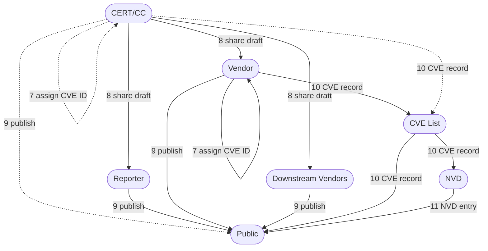

# Coordinating via CERT/CC

<!--start-->
Coordinating with the CERT/CC isn't much different from coordinating directly with a vendor, but there are a few extra steps.
This page will walk you through the process of coordinating with the CERT/CC, and what to expect when working with us.
<!--end-->



When working with the CERT/CC, the process is typically very similar to what
we laid out in [Disclosure 101](../response_process/index.md), but with a few
extra steps:

1. Security researcher reports a vulnerability to the CERT/CC and
    requests coordination assistance
2. CERT/CC analyzes the report, attempting to verify correctness of
    information, and deciding if will accept or decline to provide
    assistance

    - CERT/CC may decline to assist in otherwise valid reports for
        many reasons: low severity, resource/time constraints, etc.
   
3. If the report is accepted by the CERT/CC, then the CERT/CC will
    attempt to contact the vendor and report the vulnerability

    ```mermaid
    flowchart LR
        reporter([Reporter])
        certcc([CERT/CC])
        decide{ } 
        
        vendor([Vendor])
        reporter -->|1 report| certcc
        certcc -->|2 assist?| decide
        decide -->|2a yes<br/>3 report| vendor
        decide -->|2b no<br/>notify| reporter 
    ```

4. CERT/CC begins planning on public disclosure as a [Vulnerability Note](https://www.kb.cert.org/vuls)
   after an embargo period, typically 45 days from initial date of attempted contact, or another
   date negotiated with the reporter.
5. If the vendor replies, CERT/CC will work with the vendor to develop
   and test patches if necessary, as well as help notify any downstream
   vendors affected
   
    - If the vendor does not reply, CERT/CC will attempt to alert
      downstream vendors prior to the disclosure date and then publish
      the Vulnerability Note after sending a reminder notice to the
      vendor
   
6. If possible, CERT/CC and the vendor will provide the patch for the
    vulnerability to downstream vendors privately before public
    disclosure

    ```mermaid
    flowchart LR
        reporter([Reporter])
        vendor([Vendor])
        certcc([CERT/CC])
        downstream([Downstream Vendors])
        certcc -->|4 set embargo| certcc
        certcc <-->|4 set embargo| reporter
        certcc -->|4 set embargo| vendor
        vendor <-->|5 develop patch| certcc
        certcc -->|5a report| downstream
        vendor -->|6 provide patch| downstream
    ```

7. Prior to the publication date, a CVE ID is assigned by CERT/CC if
    necessary
    
    - unless the vendor is a CVE Numbering Authority, in which case the vendor should assign the CVE ID.
 
8. The draft Vulnerability Note and CVE ID are shared with the vendor
    and reporter for comments, typically 1-2 weeks before the
    publication date. In some scenarios, CERT/CC may decide not to
    publish, however.
9. On the agreed-upon publication date, public security advisories are
    published, detailing the issue and how to obtain the patch or
    mitigate the issues. CERT/CC may publish a Vulnerability Note, and
    typically the vendor and/or the reporter will also publish their own
    advisories.
10. Depending on who made the assignment in step 7, either the vendor or CERT/CC will create a CVE record for the
    vulnerability, which will be shared with the CVE List
11. The NVD publishes an entry for the CVE ID









!!! note "Coordination with CERT/CC"

    Please note that when a vulnerability is reported to the CERT/CC, we
    will begin to manage the process and timeline. We will take reporter's
    comments into our decision process, but by submitting a report, the
    reporter agrees that CERT/CC has final decision authority over any
    coordination and publishing on [kb.cert.org](https://www.kb.cert.org/vuls),
    and agree to follow our [Disclosure Policy](../../reference/certcc_disclosure_policy.md) 
    by default. However, as the vulnerability reporter, you
    are the owner of the vulnerability information and are free to disclose
    it on your own at any time, if you wish.
    
    Per our disclosure policy, we also reserve the right to change this
    process as necessary. As stated earlier, every case is somewhat unique
    and may require significant changes to the process depending on the
    information available.


<div class="grid" markdown>

!!! question "I'm a reporter, what should I do next?"

    See the [Reporter Response Process](../response_process/reporter.md) for more information on what to do when you find a vulnerability.
    If you've reviewed that and still need our help, see [Requesting Coordination Assistance from the CERT/CC](./reporter.md).

!!! question "I'm a vendor, what should I do next?"

    See the [Vendor Response Process](../response_process/vendor.md) for more information on what to do when you receive a vulnerability report.
    See [Working with the CERT/CC](./vendor.md) for more information on how to engage with the CERT/CC.

</div>