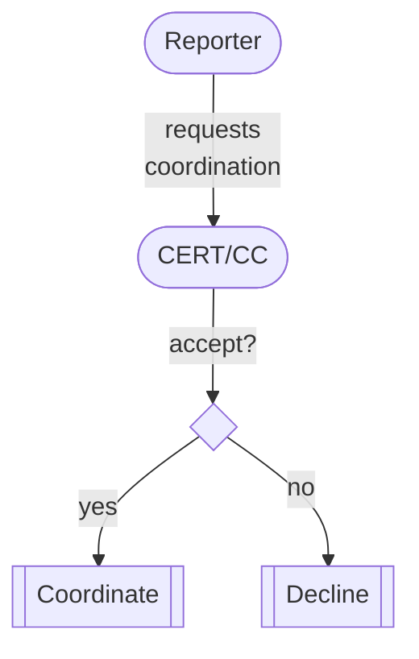

# Requesting Coordination Assistance from the CERT/CC

!!! note "Prerequisites"

    Review [Reporter Response Process](../response_process/reporter.md) first.

This tutorial picks up where the [Reporter Response Process](../response_process/reporter.md) leaves off.
It is intended for vulnerability reporters who have found a vulnerability and are requesting coordination assistance from the CERT/CC.



## Before Submitting a Request to the CERT/CC

Some things to consider before submitting a request to the CERT/CC:

!!! question "Have you contacted the vendor?"

    We usually recommend that a reporter first try reporting the
    vulnerability directly to the vendor or maintainer of the software in
    question. See the [response process for reporters](../response_process/reporter.md) for more information.

!!! warning "Non-Disclosure Agreements"

    Please note that as a security researcher or penetration tester, you or your company may be subject to a 
    Non-Disclosure Agreement (NDA) regarding vulnerabilities you find.
    Please investigate this possibility and consider any legal implications of an NDA before reporting a vulnerability.





!!! info "Initial Response Time"

    The CERT/CC typically responds to requests within 24-48 hours. Depending on the request, further analysis and decision may take additional time.

## How does the CERT/CC decide if we will accept a request?

The CERT/CC attempts to take a balanced approach to the
numbers and types of vulnerabilities handled in order to maximize
benefit to the global community.

!!! info "Declining Reports"

    The CERT/CC always reserves the right to decline to assist in coordination or to publish, especially for low priority reports or reports that are lacking information.

Even if a high quality vulnerability report is submitted, we may still
decline to assist. This is not a reflection on the reporter or the
quality of the report, but rather a result of limited time and
resources. 

Some common reasons for us to decline a request include:

- **Low CVSS score**

    ---
    We evaluate the CVSS v2 Environmental score for all new reports,
    and use this score to help set priorities on reports. We
    generally place more emphasis on vulnerabilities with higher
    scores, and generally decline reports with low Environmental
    scores. For more information on how to perform CVSS scoring on
    your vulnerability, please see the [CVSS website](http://www.first.org/cvss). 

    One result of CVSS Environmental scoring is that software that
    is not widely distributed (i.e., has a very small global user
    base) will often be declined.

- **Lack of strong evidence**

      
    ---
    Evidence must be provided before action can be taken. Reports
    lacking a proof of concept or proposed patch will be considered
    low priority or even declined.

- **Only a CVE ID is needed**
      

    ---
    The CERT/CC typically only provides CVE IDs for vulnerabilities
    we take an active role in coordinating. Reports only requesting
    a CVE ID will generally be declined. CVE IDs can be requested
    directly from the [CVE project](https://www.cve.org/ReportRequest/ReportRequestForNonCNAs).

- **Only publication is requested**
      

    ---
    The CERT/CC typically only publishes on vulnerabilities we take
    an active role in coordinating, and will generally decline
    reports on an already substantially coordinated issue.

Please be aware of these guidelines when submitting a request to the
CERT/CC.

## What happens next?

If the request is accepted, the CERT/CC will begin reaching out to the
vendor(s). The CERT/CC will then work with them as necessary to develop
a patch and provide this patch to the community. The CERT/CC may decide
to publish a [Vulnerability Note](https://www.kb.cert.org/vuls) on your vulnerability at the end of the
process, depending on the circumstances.

Please note that when a vulnerability is reported to the CERT/CC, we
will take the reporter's comments into our decision process, but by
submitting a report, the reporter agrees that CERT/CC has final decision
authority over any coordination and publishing on the [kb.cert.org](https://www.kb.cert.org)
website. 

!!! note "Reporter's Right to Disclose"

    As the vulnerability reporter, you are the owner of the
    vulnerability information and are free to disclose it on your own at any
    time, if you wish.

## What if the CERT/CC declines my report?

If your vulnerability report is declined by the CERT/CC, we still
encourage you to attempt contact with the vendor or maintainer.

If your contact attempt fails despite acting responsibly, you may
consider self-publishing (on a personal blog or website) information
about your vulnerability, or perhaps submitting information about your
vulnerability to a security mailing list such as
[Full Disclosure](http://seclists.org/fulldisclosure/).  If you do, please take care regarding how much
information is released; ideally, provide only enough information for
users to understand the issue and mitigate attacks, but not a full
proof-of-concept that can be misused.
