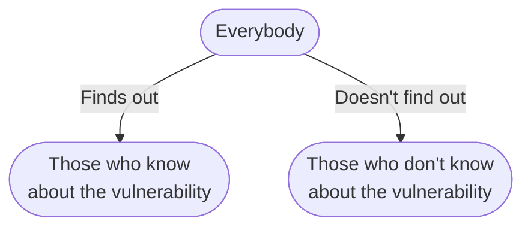

# Coordinated Vulnerability Disclosure is a Process, Not an Event

Publishing a document is an action. Releasing a
fix is an action. And while both of these are common events within the
CVD process, they do not define it.

## A Simple Description of the CVD Process

Perhaps the simplest description of
the CVD process is that it starts with at least one individual becoming
aware of a vulnerability in a product. This discovery event immediately
divides the world into two sets of people:

From that point on, those belonging to the set that knows about the vulnerability iterate on two questions:



Simple enough? Hardly. If it were, this documentation would be considerably
shorter. But with this simple iterator in mind, we'll be better able to
frame our discussion.

## Who's Involved in the CVD Process?

!!! tip inline end  "Roles in CVD"

    See [Roles in CVD](../topics/roles/index.md) for a more detailed discussion of the roles involved in the CVD process.

Ideally, product and service vulnerabilities would be either discovered
by the vendor (developer) of the software product or service itself or
reported to the vendor by a third party (finder, reporter). Informing
vendors enables them to take action to address and correct
vulnerabilities. In most cases, the vendor is the party best suited to
correct the vulnerability at its origin. <!--start-->Vendors typically remediate
vulnerabilities by developing and releasing an update to the product,
also known as a patch. However, often the vendor issuing an update is
a step in the middle of a process that starts with discovery and moves
towards remediation of the installed base of vulnerable systems.<!--end-->
Deployers must still ensure that patches are
deployed in a timely manner to the systems they need to protect.
