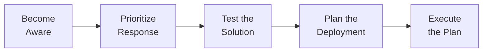

# Deployer Vulnerability Response Process

A [deployer](../../topics/roles/deployer.md)'s vulnerability response process usually involves the
following sequence of steps:

We cover each of these in more detail below.

!!! note "Deployer Vulnerability Response Process in Context"

    This brief tutorial outlines the main steps of the deployer vulnerability response process.
    Many of the steps here are covered in more detail (and from a more process-oriented rather than role-oriented perspective)
    in the [Phases of CVD](../../topics/phases/index.md) section.

!!! tip "Vulnerability Management"

    We're calling it the "deployer vulnerability response process" here, 
    but it's also known as "vulnerability management" or "patch management."
    The process is the same, regardless of the name.



## Become Aware

In order to take action, a deployer must know about the vulnerability
and have sufficient information to act on. Most often this information
originates from the product vendor. However, since not all vulnerability
reports are coordinated with the vendor for disclosure, vulnerability
information can arrive from other sources as well.

!!! tip "What to Watch Out For"

    Deployers should be on the lookout for and pay attention to:

    - Vendor security notices
    - Vendor customer support notices (not all vendors provide separate
    security notices, nor are all vulnerabilities always explicitly
    called out in update notes)
    - Vulnerability and threat intelligence services
    - Security discussions online including social media
    - Mass media coverage of vulnerabilities

## Prioritize Response

Deployers have many responsibilities beyond deploying patches. As a
result, they need to prioritize their work and integrate patch
deployment into their normal operations cycle. That might mean testing,
scheduling out-of-band fixes, or planning for scheduled maintenance
windows. Just as vendors need to triage reports in order to prioritize
patch development appropriately, deployers must decide which patches and
mitigations to deploy and when to deploy them. The deployer's workload
often makes it difficult to patch all the things as quickly as they
would like.

!!! tip "Prioritization Factors"

    Deployers should consider the following factors when prioritizing
    their response:

    - The potential impact of the vulnerability on the organization
    - The availability of an exploit
    - The availability of a patch or mitigation
    - The exposure of the affected systems to adversaries
    - The potential for negative side effects from deploying the patch or
    mitigation

!!! ssvc "SSVC's Deployer Decision Model"

    Decision support tools like the [Stakeholder-Specific Vulnerability Categorization](https://certcc.github.io/SSVC){:target="_blank"}
    (SSVC) framework can help deployers prioritize their vulnerability response actions.
    SSVC provides an example [vulnerability prioritization decision model for deployers](https://certcc.github.io/SSVC/howto/deployer_tree/){:target="_blank"}.

## Test the Solution

Testing prior to deployment is important if either of the following
conditions is true:

- The system's availability and performance are critical
- Reverting a patch deployment gone bad is difficult

In environments with efficient automated deployment and rollback
capabilities, it may not be as necessary to test as heavily. But that's
often an ideal scenario that few deployers find themselves in.

!!! tip "Consider Staged Deployments"

    Staged deployments or rollouts can be a significant help. A staged deployment is one
    where some portion of the affected systems are updated to confirm the fix
    prior to wider rollout. Thus allowing deployers to balance patch deployment
    with the risk of negative side effects.

## Plan the Deployment

Deployers have many options when it comes to planning to deploy a patch
or mitigation. Highly automated environments can dramatically shorten
the time required to complete these stages, but the functions described
here will usually still occur regardless of the deployer's automated
patching capability.

!!! tip "Planning Tips"

    Planning for a patch deployment requires two major steps:

    1. _Identify and enumerate system instances affected by the
    vulnerability._ Vulnerability management tools can be used to scan
    for affected systems and prioritize patch deployment. Information
    about affected hosts helps to define the scale of the patching
    effort required.
    2. _Set the deployment schedule._ If there are relatively few systems
    under management and vulnerabilities are fairly rare, a
    firstinfirst-out process might suffice. Larger enterprises often
    have scheduled maintenance windows during which they can deploy most
    patches. Alternatively, an organization might choose to push out a
    patch outside of a scheduled maintenance window, especially in cases
    where a vulnerability is being actively exploited or significant
    harm is expected should the vulnerability remain unpatched until the
    next maintenance window. Essentially the question boils down to
    deploy now or defer to later?

## Execute the Plan

Obviously, it is important to actually carry out the deployment of the
mitigation or fix. Automated patch deployment tools can make this
process quite efficient.

!!! tip "Monitor Deployment"

    Regardless of the degree of automation of patch
    deployment, recurring or continuous monitoring for vulnerabilities can
    help measure the success of the deployment effort.
