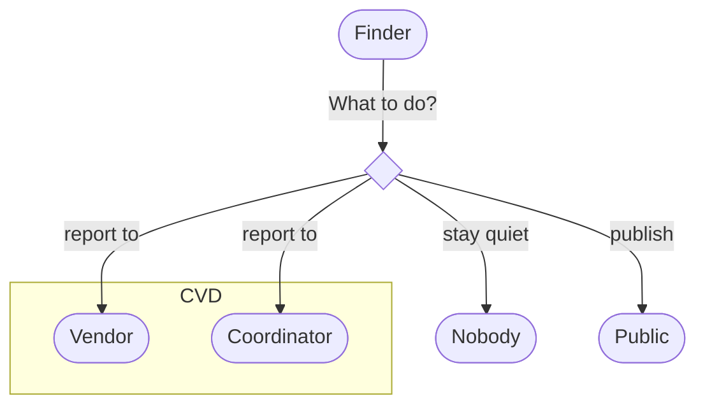

# Reporter Vulnerability Response Process
    
If you've found a vulnerability and intend to report it, 
you're about to become a vulnerability [reporter](../../topics/roles/finder.md).
While this entire guide is written with you in mind, you might need to know
where to start. That's what this page is for.

!!! question "Who is a Vulnerability Reporter?"

    We generally refer to anyone that contacts us or a vendor to
    report a vulnerability in a product, service, or system
    as a
    _vulnerability reporter_, or usually simply [*reporter*](../../topics/roles/finder.md).
    This is to distinguish from the fact that the reporter is not always the
    original person that discovered the vulnerability, or in some cases,
    that several people discovered the same vulnerability simultaneously.
    Another term is _finder_, as in the person that finds a vulnerability
    and reports it, but in terms of coordination, it's the reporter role
    that is interacting with the CVD process.

## Step 0: Find a Vulnerability

Since you're here, you've probably already done this step.

## Step 1: Decide What to Do

The finder of a vulnerability has several options for what to do next.

We'll cover the coordinated disclosure options in a moment, but first let's pause to examine the non-CVD options.

!!! warning "Do Nothing?"

    It is possible to find a vulnerability and do nothing about it. This is
    not usually recommended, as it leaves the vulnerability unaddressed and
    potentially exploitable by others. But it is a choice that is available
    to the finder.

!!! warning "Go Public?"

    It is also possible to find a vulnerability and publish it immediately.
    This is sometimes called _full disclosure_. This is also not usually
    recommended, as it can lead to exploitation of the vulnerability before
    a fix is available. But it is a choice that is available to the finder.

## Step 2: Prepare a Report

If you've decided to report the vulnerability, you'll need to prepare a report.
The best advice is to document your vulnerability well. This typically
means providing:

-   the exact software version or model version affected
-   a description of how the vulnerability was discovered (including
    what tools were used) or what you were doing when you encountered
    the vulnerability
-   a proof of concept (PoC) code or instructions demonstrating how the
    vulnerability may be exploited; ideally, a suggested patch for the
    issue may be included
-   description of the impact of the vulnerability and attack scenario
    (for example, see BugCrowd's [write up](https://forum.bugcrowd.com/t/writing-a-bug-report-attack-scenario-and-impact-are-key/640) on the topic)
-   any time constraints (for example, give a date of publication or
    presentation at a conference if you know)

!!! tip "Providing Useful Information"

    See [Providing Useful Reports](../../howto/initiation/useful_reports.md) for more information on what makes a report useful.



## Step 3a: Engage the Vendor 

We usually recommend that a reporter first try reporting the
vulnerability directly to the [_vendor_](../../topics/roles/vendor.md) or maintainer of the software in
question.

The vendor or maintainer of the software is often easy to contact and
responsive to security concerns. Simply send your report to the vendor
and ask what timeline for a fix is needed.

!!! tip "Finding Vendor Contacts"

    See [Finding Vendor Contacts](../../howto/initiation/find_vendor_contact.md) for more information on finding the right contact at a vendor.

## Step 3b: Engage a Coordinator

There are several reasons for not coordinating directly with the vendor.
If any of the following conditions are true, you might consider reaching
out to a [coordinator](../../topics/roles/coordinator.md) like the CERT/CC
for assistance in coordinating or publishing your
case if one or more of the following conditions are true:

- the vendor or maintainer does not reply in a reasonable time
    frame (typically about two weeks)
- the vendor was initially responsive, but then stopped responding
    (typically about two weeks of silence)
- the vendor has fixed a critical issue, but did not clearly
    document the fix in a security advisory, news article, or changelog
- the vulnerability affects multiple vendors and would be difficult
    for an individual reporter to coordinate alone
- the vulnerability is extremely serious and could cause extensive
    nation-wide or world-wide damage (for example, problems with
    internet infrastructure protocols like DNS and NTP)
- you wish to remain anonymous (if so, you may also wish to use a
    pseudonym and contact the coordinator with a free _throw-away_ email
    account)

!!! tip "More reasons to engage a Coordinator"

    We have collected a variety of other [Reasons to Engage a Coordinator](../../howto/coordination/coordinator_reasons.md)
    in the [How To](../../howto/index.md) section of this site.

!!! tip "Requesting Coordination Assistance from the CERT/CC"

    To request assistance, please fill out our [Vulnerability Reporting Form](https://kb.cert.org/vuls/report/)
    (VRF)

    For more information about working with the CERT/CC, you may wish to
    read the following resources that describe our typical process:

    -  [CERT/CC Disclosure Policy](../../reference/certcc_disclosure_policy.md) -- we typically disclose vulnerability information
    in a publication within 45 days of initial vendor contact attempt
    -  [Guidelines for Requesting Coordination Assistance](../coord_certcc/reporter.md) -
    some tips for submitting a coordination assistance request to CERT/CC

## Step 4: Coordinate

[CVD How-To](../../howto/index.md) leads to more detailed information and advice about the CVD process.