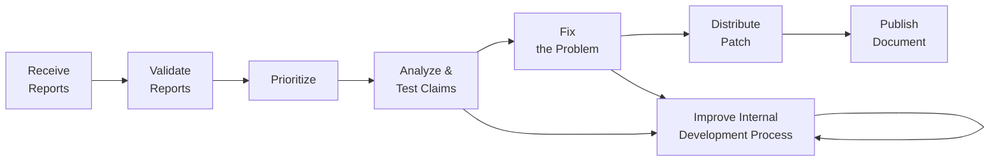

# Vendor Vulnerability Response Process

In order to effectively mitigate the impact of vulnerabilities in their
products and services, [vendors](../../topics/roles/vendor.md) must be able to perform the following
specific tasks:

!!! note "Vendor Vulnerability Response Process in Context"

    This brief tutorial outlines the main steps of the vendor vulnerability response process.
    Many of the steps here are covered in more detail (and from a more process-oriented rather than role-oriented perspective)
    in the [Phases of CVD](../../topics/phases/index.md) section.

!!! info "ISO/IEC Standards for Vulnerability Disclosure and Handling Processes"

    The ISO/IEC standards [29147 _Vulnerability disclosure_](https://www.iso.org/standard/72311.html) and
    [30111 _Vulnerability handling processes_](https://www.iso.org/standard/69725.html)
    offer specific models for external-
    and internal-facing vendor vulnerability response practices. Readers are
    encouraged to review and apply those standards to their operational
    vulnerability response practice. ISO/IEC 29147 describes an
    outward-facing CVD process. ISO/IEC 30111 addresses the internal
    processes associated with vendor vulnerability response.

## Receive Reports

The first step in the vendor vulnerability response process is to receive
vulnerability reports. Reports can come from a variety of sources,
including internal testing, customer reports, third-party researchers,
and public disclosure. 

!!! tip "Have a Mechanism to Receive Reports from All Sources"

    Vendors should have a mechanism in place to
    receive reports from all of these sources. This mechanism should be
    secure, reliable, and easy to use. It should also be well-publicized so
    that reporters know how to submit reports.

## Validate Reports

Validation of vulnerability reports is the next step in the vendor
vulnerability response process. The goal of this step is to determine
whether the report is valid and whether the reported issue is indeed a
vulnerability.

!!! tip "Validation is Surface-Level"

    Validation is a surface-level process. It is not the same as
    understanding the vulnerability in detail. The goal of validation is to determine
    whether the report is sufficient to take further action on and whether the reported issue is indeed a
    vulnerability. Understanding the vulnerability comes later in the process.

## Prioritize

Once a vulnerability report has been validated, the vendor must prioritize
the response. This is a critical step, as it is unlikely that the vendor
will be able to fix all reported vulnerabilities at once. Prioritization
is based on a variety of factors, including the severity of the
vulnerability, the likelihood of exploitation, and the potential impact of
exploitation.

!!! tip "Prioritization Criteria"

    The criteria for prioritization should be well-documented and
    consistently applied. This will help ensure that the vendor's
    vulnerability response process is transparent and fair.
    
    The [Stakeholder-Specific Vulnerability Categorization](https://certcc.github.io/SSVC)
    SSVC) framework provides decision support tools for vendors to use in
    prioritizing vulnerabilities.

## Analyze & Test Claims

Isolating the root cause of a vulnerability and developing a fix can be
complex. The vendor must analyze the vulnerability to understand how it
can be exploited and how it can be fixed. This often involves testing the
vulnerability to ensure that the fix is effective and does not introduce
new vulnerabilities.

!!! tip "Understanding the Vulnerability"

    Understanding the vulnerability is critical to developing an effective
    fix. Vendors often need to isolate the root cause of the vulnerability to
    ensure that their fix is comprehensive and effective.

## Fix the Problem

Once the vulnerability has been analyzed and understood well enough for the vendor to know how to fix it,
it is time to develop and test the fix. This can be as simple as a one-line change or a complex architectural refactoring.

!!! warning "Do not just fix the proof-of-concept"

    Some vendors will only fix the behavior specifically triggered by the proof-of-concept
    exploit provided by the reporter. This is a mistake, because it may leave open other 
    ways to trigger the same vulnerability. The vendor should fix the root cause of the
    vulnerability, not just the specific proof-of-concept exploit.

## Distribute Patch

A fix is not effective until it is deployed to all vulnerable systems. Some vendors
have mechanisms in place to automatically deploy patches to their customers. Others rely on
customers to manually apply patches. In either case, the vendor should ensure that the patch
is made available to all affected systems.

!!! tip "Automated Patch Deployment"

    Automated patch deployment can be an effective way to ensure that patches are
    deployed quickly and consistently. This can help reduce the window of opportunity for
    attackers to exploit the vulnerability.

## Publish Document

Many [deployers](../../topics/roles/deployer.md) rely on the vendor to provide clear and
accurate information about the vulnerability and the fix in order to know that they need to take action.
This information should be made available to the public as soon as the patch is available.

## Process Improvement

Having a mechanism to receive and track the disposition of vulnerability
reports is an important first step in establishing a vendor's
vulnerability response capability. But it should not stop there; vendors
should strive for continuous improvement of their software development
process.
Improving the development process can reduce the number of
vulnerabilities in future products. Vendors can establish a feedback
loop by performing a root cause analysis of vulnerabilities reported.
Lessons learned can then inform modifications to the development
process. 

!!! tip "Ways Vulnerability Response Feeds Back into the Development Lifecycle"
    Some of the ways vulnerability response can feed back into the
    development lifecycle include the following:

    - **Root cause analysis** -- to identify common causes and learn how
    to reduce future introduction of similar vulnerabilities. Questions
    to ask include the following: How did this vulnerability make it
    into the released product without being detected? How could it have
    been found and fixed earlier, before release? How might the
    vulnerability have been avoided entirely?
    - **Automated testing** -- to find vulnerabilities sooner, ideally
    before release. Continuous integration (CI) systems and DevOps
    practices provide excellent opportunities to incorporate automated
    security testing. For example, a CI server could initiate a fuzzing
    campaign on each nightly build of a product. An automated release
    process might require that code pass all static analysis tests with
    no significant findings before proceeding.
    - **Threat modeling** -- to identify high**-**risk portions of a
    product earlier in the development process so potential
    vulnerabilities can be found and addressed at design time, before
    they are even implemented.

!!! tip "Evaluating the Vendor Security Response Process"

    It is a mistake to evaluate a product favorably based solely on its
    having a low number of publicly known vulnerabilities. In fact, the
    known vulnerability count in a product is usually not indicative of the
    quality of a product. There are many reasons a product may have few
    public vulnerability reports: these include (1) the vendor might lack
    proper CVD capabilities or have a history of threatening legal action
    against finders and reporters if they publish vulnerability reports, or
    (2) the product's prevalence or niche may be too small to warrant
    finder attention. 
    
    Instead, we have found that a vendor's CVD capability and vulnerability
    response process maturity is often a more important indicator of its
    commitment to quality than its vulnerability counts alone. Development
    practices, as human processes, inevitably fail. Vendors that acknowledge
    this fact and create a good CVD practice are well positioned to
    compensate for this inevitability.

